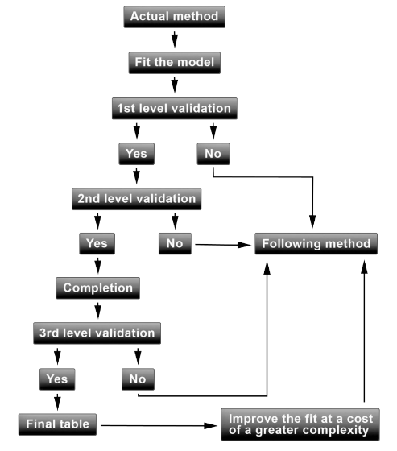

```{r setup, include=FALSE}
knitr::opts_chunk$set(echo = TRUE)
library(mgcv)
library(tidyverse)
```

# Mortality Tables Estimation with Portfolio Experience

We will describe an operational framework for constructing and validating
prospective mortality tables specific to an insurer. The material is based on studies carried
out by the Institut des Actuaries.

We will present several methodologies and the process of validation allowing an or-
ganism to adjust a mortality reference to get closer to a best estimate adjustment of its
mortality and longevity risks. The techniques proposed are based only on the two following
elements:

• A reference of mortality

• Data, line by line originating from a portfolio provided by the insurer

We analyze the mortality as a function of both the attained age x and the calendar year t.

We assume that the number of deaths of people aged $x$ at time $t$, that
die within calendar year $t$, $D_{x,t}$, are modelled by a Poisson
random variable
$D_{x,t}∼Poisson(E_{x,t}\mu_{x,t})$,
where $E_{x,t}$ is the average population during calendar year $t$
of people aged $x$, and $μ_{x,t}$ the force of mortality of people
aged $x$ at time $t$.




## The Methods 

Al the methods here are ordered in the sense of complexity, being the first on e the least flexible and the last one the most flexible. It all dependes on the data. These section was inspired from Chapter 9 of Computational Actuarial Science by A. Charpentier.


### Method 1: Approach Involving One Parameter

$$
\log (\mu_{x,t}) = \beta \log (q_{x,t}^{ref}) 
$$

### Method 2: Approach Involving Two Parameters with a Semiparametric Relational Model

$$
\log (\mu_{x,t}) = \beta_0+\beta_1 \log (q_{x,t}^{ref}) 
$$
### Method 3: Poisson GLM Including Interactions with Age and Calendar Year

$$
\log (\mu_{x,t}) = \beta_0+\beta_1 \log (q_{x,t}^{ref}) +\beta_2x+\beta_3t+\beta_4xt
$$

### Method 4: Nonparametric Smoothing

$$
\log (\mu_{x,t}) = \beta_0+\beta_1 \log (q_{x,t}^{ref}) +h_1(x)+h_2(t)
$$
### Method 5: One of the above, but just keep adding other things...

$$
\log (\mu_{x,t}) = \beta_0+\beta_1 \log (q_{x,t}^{ref}) +h_1(x)+h_2(t)+sex+sex*x
$$

## Estimation 

We can see that all of these models can be thought as regression models for the mortality rate, and under the assumptions of deaths following a Poisson distribution, then we can use the whole Poisson regression framework for estimation purposes. That is, we can use the number of deaths $D_{x,t}$ as the response variable and the $q_{x,t}^{ref}$, $x$, $t$ as the covariates in a glm to get estimates of the mortality rate for each age and time.


$$D_{x,t} \sim Poisson( \tilde{\mu}_{x,t} ) $$

 where $ \tilde{\mu}_{x,t} = E_{x,t} \mu_{x,t}  $, and so
 
 
$ \log( \tilde{\mu}_{x,t} ) = \log(E_{x,t}) +\log(\mu_{x,t})  $

Here the log of the exposure term acts as an offset in the model. Recall that this model is estimated in the framework of Maximum likelihood estimation.

Finally, note that the final one year death probabilities (under the Poisson assumptions) would be then given by:

$$
\hat{q}_{x,t} = \hat{\mu}_{x,t}  = \exp(  \log(\hat{\mu}_{x,t} ) )
$$
Observe that this is somehow equivalent to use a log-log link function for the probabilities in a logistic regression framework. All of these models are somehow connected!


## Goodness of fit

We have several ways of assessing GoF for these models, here are some examples:


## Case of study

```{r }
load("data.Rdata")
data$logEx= log(data$Ex)
head(data)

```

I have simulated a dataset from a life table that was estimated using the actual experience of a Colombian insurance company. For obvious reasons, I cannot provide or show the real data and real life table of this company. Unfortunately, the info was only for specific year, hence  models including time effects are not possible to be estimated.

The reference life table here would be the RV08, the official life table that Colombian insurances and pension funds must use in the country according to regulations.


### Method 1: Approach Involving One Parameter

$$
\log (\mu_{x}) = \beta \log (q_{x}^{ref}) 
$$

```{r }
#Estimation of method 1
fit_1 <- glm(formula = Dx ~ -1 + I(log(q_ref)),
             family = poisson(link = "log"),
             data = data,
             offset = logEx)

#See estimation
summary(fit_1)

#Residual analysis qq-plot
residuals_1 <- residuals(fit_1,type = "deviance")
qqnorm(residuals_1)
qqline(residuals_1) 

#Chi_2 GoF test
residuals_1 <- residuals(fit_1,type = "pearson") #Pearson residuals
sum(residuals_1^2) #Chi_2 Statistis
1-pchisq(q = sum(residuals_1^2),df = dim(data)[1]-fit_1$rank ) #P-value
#Not a good fit ....

```

### Method 2: Approach Involving Two Parameters with a Semiparametric Relational Model

$$
\log (\mu_{x}) = \beta_0+\beta_1 \log (q_{x}^{ref}) 
$$


```{r  }
#Estimation of method 2
fit_2 <- glm(formula = Dx ~ I(log(q_ref)),
             family = poisson(link = "log"),
             data = data,
             offset = logEx)

#See estimation
summary(fit_2)

#Residual analysis qq-plot
residuals_2 <- residuals(fit_2,type = "deviance")
qqnorm(residuals_2)
qqline(residuals_2) 

#Chi_2 GoF test
residuals_2 <- residuals(fit_2,type = "pearson") #Pearson residuals
sum(residuals_2^2) #Chi_2 Statistis
1-pchisq(q = sum(residuals_2^2),df = dim(data)[1]-fit_2$rank ) #P-value
#Not a good fit ....

```


### Method 3: Poisson GLM Including Interactions with Age and Calendar Year

$$
\log (\mu_{x,t}) = \beta_0+\beta_1 \log (q_{x,t}^{ref}) +\beta_2x
$$

```{r  }
#Estimation of method 3
fit_3 <- glm(formula = Dx ~ I(log(q_ref))+x,
             family = poisson(link = "log"),
             data = data,
             offset = logEx)

#See estimation
summary(fit_3)

#Residual analysis qq-plot
residuals_3 <- residuals(fit_3,type = "deviance")
qqnorm(residuals_3)
qqline(residuals_3) 

#Chi_2 GoF test
residuals_3 <- residuals(fit_3,type = "pearson") #Pearson residuals
sum(residuals_3^2) #Chi_2 Statistis
1-pchisq(q = sum(residuals_3^2),df = dim(data)[1]-fit_3$rank ) #P-value
#Not a good fit ....

```


### Method 4: Nonparametric Smoothing

$$
\log (\mu_{x,t}) = \beta_0+\beta_1 \log (q_{x,t}^{ref}) +h_1(x)
$$
```{r  }

#Estimation of method 4
fit_4 <- gam(formula = Dx ~ I(log(q_ref))+s(x),
             family = poisson(link = "log"),
             data = data,
             offset = logEx)

#See estimation
summary(fit_4)

#Residual analysis qq-plot
residuals_4 <- residuals(fit_4,type = "deviance")
qqnorm(residuals_4)
qqline(residuals_4) 

#Chi_2 GoF test
residuals_4 <- residuals(fit_4,type = "pearson") #Pearson residuals
sum(residuals_4^2) #Chi_2 Statistis
1-pchisq(q = sum(residuals_4^2),df = dim(data)[1]-fit_4$rank ) #P-value
#Looks like a good fit ....

```


### Method 5: One of the above, but just keep adding other things...

$$
\log (\mu_{x,t}) = \beta_0+\beta_1 \log (q_{x,t}^{ref}) +h_1(x)+sex+sex*x
$$

```{r  }

#Estimation of method 4
fit_5 <- gam(formula = Dx ~ I(log(q_ref))+s(x)+sex+sex*x,
             family = poisson(link = "log"),
             data = data,
             offset = logEx)

#See estimation
summary(fit_5)

#Residual analysis qq-plot
residuals_5 <- residuals(fit_5,type = "deviance")
qqnorm(residuals_5)
qqline(residuals_5) 

#Chi_2 GoF test
residuals_5 <- residuals(fit_5,type = "pearson") #Pearson residuals
sum(residuals_5^2) #Chi_2 Statistics
1-pchisq(q = sum(residuals_5^2),df = dim(data)[1]-fit_5$rank ) #P-value
#Not always adding more stuff is good ....

```

## Conclusion


In the particular case of study, it seems that Method 4 was the one giving the best fit to the data. Observe that altough Method 5 is more flexible, it did not provide a better fit. The idea is to go little by little until  find the best model.

I check the fitted prob with the real probabilities from the simulation and it actually gives a good fit!

The estimated life tables are then:

```{r }

data$q_hat4 = predict(fit_4,type = "response")

#For MALES
data %>% filter( sex == 0) %>% group_by(x) %>% summarise(q_ref,q_hat4)

#For FEMALES
data %>% filter( sex == 1) %>% group_by(x) %>% summarise(q_ref,q_hat4)
```


